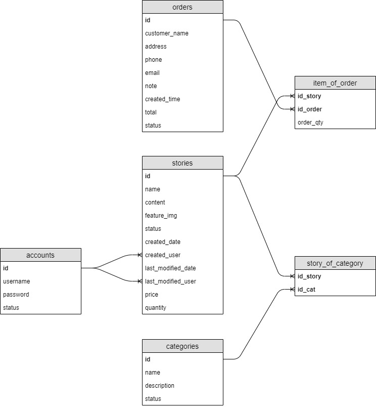

# Angular WebStories

This project is using version 8 of angular. This project is introduce about Stories and sale them.

**Please support this project by simply putting a Github star ⭐. Share this library with friends on Twitter and everywhere else you can. 🙏. Thanks**

## Table of contents

- [Installation](#installation)
- [Versions](#versions)
- [Template](#template)
- [Database structure](#database-structure)
- [Angular 8 features used](#angular-8-features-used)
- [Author](#author)
- [Thanks](#thanks)
- [Copyright and license](#copyright-and-license)

## Installation
### Backend NodeJS
Run `npm install` to install all the required dependencies

Then run `node server.js` to start a backend server.

### Frontend Angular
Run `npm install` to install all the required dependencies

Then run `ng serve` to start a dev server.
Navigate to `http://localhost:4200/`. The app will automatically reload if you change any of the source files.

## Versions
### Version 0.0.1
This is begin version of project. All features:

 * Admin Login & Logout
 * Story Listing
 * Story Searching
 * Story Details
 * Story Addition
 * Story Update
 * Story Deletion
 * Category Listing
 * Category Searching
 * Category Details
 * Category Addition
 * Category Update
 * Category Deletion
 * Order Listing
 * Order Filtering
 * Order Details
 * Order Addition
 * Order Update
 * Order Deletion

## Template
This project using HTML templates designed by our in branch `html`

## Database structure
There is database structure of project WebStories:

## Angular 8 features used

 * Modules
 * Routes
 * Services
 * Components
 * Forms Module
 * Reactive Forms
 * Directives
 * Pipes
 * Filters

## Author

**Joomaio**

- <https://github.com/xxxxxxx>

## Thanks

Thanks to all contributors and their support.

If you have an idea or you want to do something, tell our or just do it!
We're always happy to hear your feedback!

## Copyright and license

Code and documentation copyright 2018 the authors. Code released under the [License](https://github.com/xxxxx/LICENSE).

Enjoy :metal: